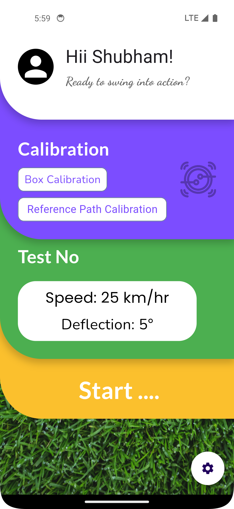

# Golf App with IoT Integration

The Golf App is an innovative tool designed for golfers to analyze their shots in real-time. By integrating IoT devices, the app measures the speed and deflection of golf balls, providing actionable insights to improve your game.

## App Screenshots

<p align="center">
  
  
  
</p>

## Features

- **Real-Time Data Analysis**:
  - Measure **Speed** and **Deflection** of the golf ball using IoT sensors.
- **Data Persistence**:
  - **Online**: Sync data to **AWS DynamoDB** for cloud storage and analysis.
  - **Offline**: Use **SharedPreferences** to save data locally.
- **MQTT Protocol**:
  - Communicate with IoT devices for seamless data transfer.
- **Progress Tracking**:
  - View historical data and performance trends.
- **Customizable Alerts**:
  - Set thresholds for speed and deflection to receive instant feedback.
- **User-Friendly Interface**:
  - Clean design with Light and Dark themes.

## App Structure

The app follows the **MVVM (Model-View-ViewModel)** architecture for modularity and scalability.

```
lib/
├── core/
│   ├── services/
│   │   ├── mqtt_service.dart          // MQTT client for IoT communication
│   │   ├── aws_service.dart           // AWS DynamoDB integration
│   │   ├── navigation_provider.dart
│   │   └── shared_pref_helper.dart    // Local storage management
│   ├── error_handling/
│   │   ├── app_exception.dart
│   │   └── error_handler.dart
│   ├── utils/
│       ├── themes/
│       │   ├── app_theme.dart
│       │   └── theme_provider.dart
│       ├── animation.dart
│       ├── color_resources.dart
│       ├── dimensions.dart
│       ├── images.dart
│       ├── styles.dart
│       └── util.dart
├── data/
│   ├── models/
│   │   ├── golf_data_model.dart       // Data model for speed and deflection
│   │   ├── threshold_model.dart       // Model for customizable alerts
│   │   └── user_model.dart            // User profile and preferences
│   ├── providers/
│   │   ├── golf_data_provider.dart    // Provides processed golf data to views
│   │   ├── threshold_provider.dart    // Handles alert threshold settings
│   │   └── user_provider.dart         // Manages user-related data
│   └── repo/
│       ├── local_repo.dart            // Local database operations
│       └── remote_repo.dart           // AWS DynamoDB operations (CRUD)
├── repository/
│   ├── repository.dart                // Central abstraction layer for data
│   └── repository_impl.dart           // Combines AWS and local storage
├── view/
│   ├── components/
│   │   ├── speed_chart.dart
│   │   ├── deflection_chart.dart
│   │   ├── data_card.dart
│   │   └── alert_widget.dart
│   ├── screens/
│       ├── home_screen.dart           // Dashboard for golf data
│       ├── history_screen.dart        // Historical data and trends
│       ├── settings_screen.dart       // User settings and preferences
│       └── splash_screen.dart
└── main.dart
```

## Technology Stack

- **Flutter**: Cross-platform UI framework.
- **MVVM Architecture**: Ensures a clean separation of concerns and testability.
- **MQTT Protocol**: Facilitates communication between the app and IoT devices.
- **AWS DynamoDB**: Cloud database for storing golf data.
- **SharedPreferences**: Offline storage for user data.
- **Custom Charts**: Dynamic visualizations for speed and deflection trends.

## Setup & Compilation Instructions

### Prerequisites:
- Dart version: 3.5.4
- DevTools version: 2.37.3
- Flutter version: 3.24.5 (Stable)

### Steps:
1. Clone the repository.
2. Open the project in Android Studio or VS Code.
3. Run `flutter pub get` to fetch all dependencies.
4. Set up your AWS credentials and MQTT broker details in `lib/core/services/`.
5. Connect a physical or virtual device for testing.
6. Execute `main.dart` to launch the app.

## Usage

- **Real-Time Data**:
  - Pair your IoT device with the app using the MQTT protocol.
  - View real-time speed and deflection metrics on the dashboard.
- **Historical Data**:
  - Access past performance data stored in AWS DynamoDB or locally.
- **Alerts**:
  - Set speed and deflection thresholds in the settings to receive notifications.
- **Offline Mode**:
  - All recent data is saved locally using SharedPreferences for offline access.
- **Themes**:
  - Switch between Light and Dark modes for better visibility.

## Design Decisions

- **Scalability Focus**: The MVVM architecture ensures the app is extensible and maintainable.
- **Real-Time Processing**: Data from IoT devices is processed and displayed instantly using MQTT.
- **Custom Charts**: Engaging visualizations enhance user experience and provide clear insights.
- **Error Handling**: Robust mechanisms for connectivity issues and data inconsistencies.

---
Developed by [Your Name]
